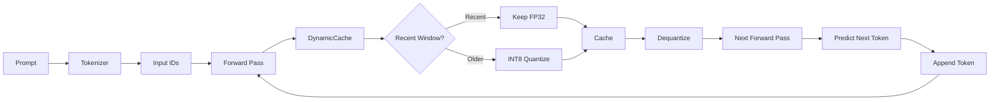
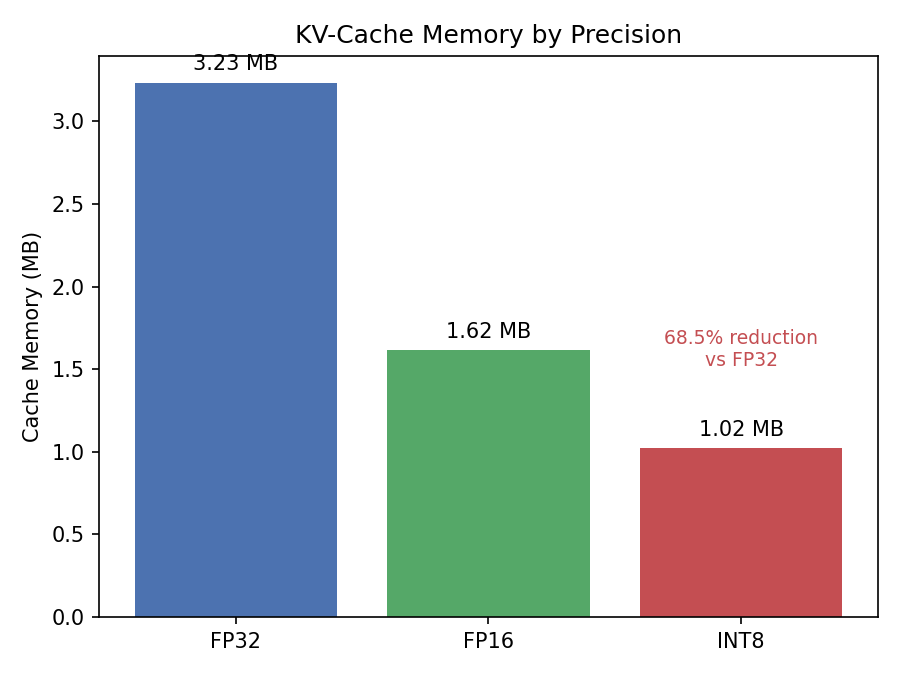
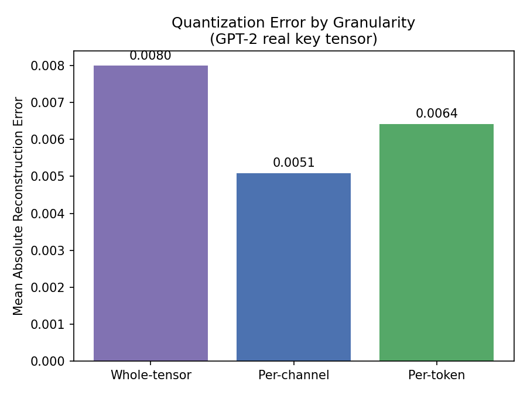
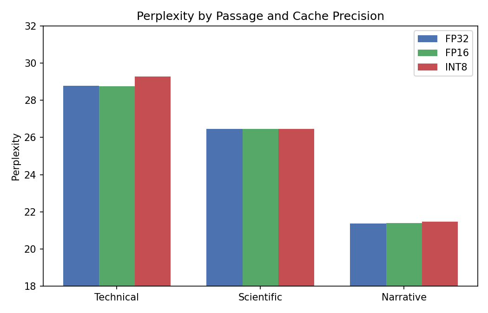

# KV-Cache Quantization for LLM Inference

## Highlights

- Built a custom token-by-token generation loop (no `.generate()`)
- Implemented asymmetric and symmetric INT8 quantization from scratch
- Compared whole-tensor, per-channel, and per-token quantization
- Implemented a KIVI-inspired recency window (recent cache entries remain full precision)
- Benchmarked FP32, FP16, and INT8 using latency, memory, and perplexity

---
## Architecture

<!-- # Why KV Cache Matters

During autoregressive generation, transformer models cache attention **Keys** and **Values** from previous tokens instead of recomputing them every decoding step.

While this dramatically speeds up inference, the cache grows **linearly with sequence length**, making it one of the primary memory bottlenecks in production LLM serving.

This project explores one practical mitigation strategy: **compressing the KV cache using INT8 quantization while preserving generation quality.**

--- -->

# Results

| Precision | Cache Memory | Reduction | Avg. Perplexity | Δ Perplexity |
|-----------|-------------:|----------:|----------------:|-------------:|
| FP32 | 3.2344 MB | — | 25.2188 | — |
| FP16 | 1.6172 MB | 50.0% | 25.2183 | ~0% |
| INT8 | 1.0197 MB | **68.5%** | 25.3979 | **0.71%** |

**Headline result**

- **68.5% KV-cache memory reduction**
- **0.71% average perplexity increase**
- **FP16 provides a 50% memory reduction with no measurable quality degradation**

Perplexity was measured using teacher forcing across three diverse text passages (technical, scientific, and narrative). INT8 degradation ranged from **0.4%–1.75%**, with information-dense technical text showing the highest sensitivity.

---

# Project Structure

| File | Purpose |
|------|---------|
| `baseline.py` | Baseline inference benchmark (latency, throughput, process memory) |
| `inspect_cache.py` | Inspect `past_key_values` tensors (shape, dtype, memory footprint) |
| `quantize_utils.py` | Symmetric/asymmetric INT8 quantization and dequantization with multiple granularities |
| `manual_quant_generate.py` | Custom generation loop with DynamicCache manipulation and KIVI-inspired recency window |
| `comparison.py` | FP32 vs FP16 vs INT8 benchmark suite |
| `perplexity_eval.py` | Teacher-forced perplexity evaluation across multiple passages |

---

# Implementation

The project consists of four major components.

### Baseline Benchmark

A reference implementation measuring inference latency, throughput, and memory usage across multiple prompt lengths.

---

### Cache Inspection

Direct inspection of Hugging Face's `past_key_values` to understand:

- tensor shapes
- tensor dtypes
- cache growth
- exact storage footprint

---

### Quantization

Implemented from scratch:

- symmetric (max-abs) quantization
- asymmetric (min-max) quantization
- whole-tensor quantization
- per-channel quantization
- per-token quantization

All implementations were validated independently before integration into the generation pipeline.

---

### Manual Generation Loop

Rather than using `model.generate()`, generation is performed token-by-token while directly manipulating `DynamicCache`.

The implementation follows KIVI's central idea:

- recent KV entries remain full precision
- older entries are stored using INT8
- dequantization occurs before reuse during attention

---

# Key Findings

1. Per-channel / per-token quantization consistently outperformed whole-tensor quantization.

<!-- Lower reconstruction error was observed on both synthetic tensors and real GPT-2 KV-cache tensors.

--- -->

2. Asymmetric quantization outperformed symmetric quantization.

<!-- Although GPT-2 key tensors are centered near zero, their value distribution is noticeably skewed (approximately **[-6.22, 7.91]**). Allowing a learned zero-point reduced reconstruction error by roughly **15%**, matching the design choices made in methods such as KIVI.

--- -->

3. FP16 is essentially free.

<!-- FP16 reduced memory usage by **50%** without measurable quality degradation.

--- -->

4. INT8 introduces a small, measurable quality cost.

<!-- Average perplexity increased by **0.71%**, with technical text showing greater sensitivity than conversational or narrative text.

--- -->
---

# Limitations

- Memory reduction is **theoretical**. Quantized tensors are stored compactly, but attention still operates on dequantized floating-point tensors.
- Evaluated on GPT-2 (124M) running on CPU rather than production-scale LLMs.
- Throughput measurements are CPU-only and single-run; latency should therefore be interpreted as approximate.

---

# Model

- GPT-2 Small (124M parameters)
- PyTorch
- Hugging Face Transformers